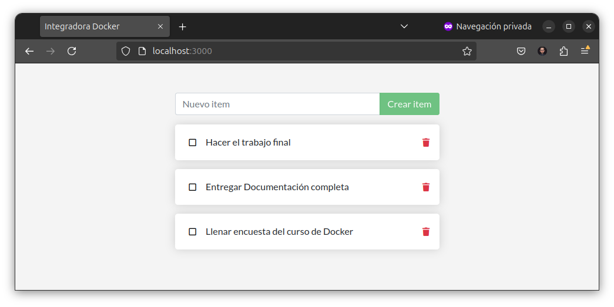
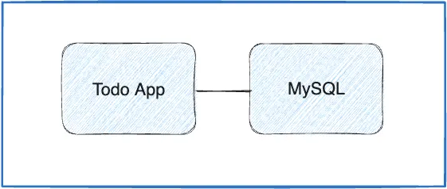

# Fundamentos y usos prácticos de Docker

[](https://docker.com/)
[](https://centro410laplata.edu.ar/)
[](https://idepba.com.ar/)
[](https://atepba.org.ar/)


## Trabajo integrador 🐳


En el presente trabajo integrador se evaluará:

- Conteinerizar una aplicación simple.
- Buildear y correr una imágen como un contenedor.
- Compartir imágenes usando Docker Hub.
- Deployar aplicaciones Docker usando multiples contenedores usando una base de datos.
- Correr la aplicación usando docker compose.

> [!IMPORTANT]  
> La fecha límite de entrega es el 11/11/24.

## Prerequisitos

- Tener instalado Docker Desktop o Docker CLI
- Tener instalado un editor de texto, como <a href="https://notepad-plus-plus.org/downloads/" target="_blank">Notepad++</a> o <a href="https://vscodium.com/" target="_blank">VSCodium</a>.
- Tener instalado un cliente Git (opcional).


### Forma de entrega

Puede elegir alguna de estas opciones:

- Realizar un [fork](https://github.com/kity-linuxero/docker-integradora/fork) del repositorio y modificar el archivo `engregable.md` y agregar el `compose` solicitado.
- Crear un repositorio de cero y subir ahí los archivos solicitados siguiendo el template en el archivo [entregable.md](./entregable.md)
- Crear un archivo de texto siguiendo los pasos del archivo `entregable.md` y entregar un zip con la entrega y el compose.

Enviar el link del repositorio o archivo de texto por <a href="https://docker.idepba.com.ar/clase1.html#/intro-presentacion" target="_blank">mail al instructor</a>.


## Parte 1 - Conteinerizar una Aplicación

Para este trabajo integrador, usaremos un simple _todo list manager_ que corre en Node.js. Si no estás familiarizado con Node.js, no te preocupes, este trabajo integrador no requiere conocimientos de programación. Solo usaremos una app de ejemplo para poder armar las imágenes y correr los contenedores.



### 1. Obtener la aplicación

Antes de poder correr la aplicación, necesitamos obtener el código fuente y descargarlo.

- Clonar el repositorio usando el siguiente comando:

    ```bash
    git clone https://github.com/kity-linuxero/docker-integradora.git
    ```
- Si no tiene un cliente git instalado, puede descargar el repositorio del siguiente [link](https://codeload.github.com/kity-linuxero/docker-integradora/zip/refs/heads/main). Luego debe descomprimir el archivo zip.

- Una vez descargada la aplicación, deberías ver el código fuente de la misma con la siguiente estructura de directorios en la carpeta `app`:

    ```
        app/
        ├─ spec/
        ├─ src/
        ├─ yarn.lock
        ├─ package.json
        ├─ .dockerignore
    ```

### 2. Buildear imágen

> [!TIP]
> Consulte apuntes de <a href="https://docker.idepba.com.ar/clase3.html#/docker_build" target="_blank">docker build</a>.

- Para buildear la imágen usaremos un `Dockerfile` como el siguiente. Observe y analice el archivo `Dockerfile`.
- Cree un archivo llamado `Dockerfile` en la carpeta `app` con el siguiente contenido:


    ```dockerfile
    # Usamos la imagen base de Alpine Linux
    FROM alpine:latest

    # Actualizamos los paquetes e instalamos Node.js y Yarn directamente desde los repositorios oficiales
    RUN apk add --no-cache nodejs yarn

    # Establecemos el directorio de trabajo
    WORKDIR /app

    # Copiamos los archivos del proyecto al contenedor
    COPY . .

    # Instalamos las dependencias del proyecto
    RUN yarn install --production

    # Exponemos el puerto de la aplicación (ejemplo: 3000)
    EXPOSE 3000

    # Comando por defecto para ejecutar la aplicación
    CMD ["node", "src/index.js"]
    ```

**[ENTREGABLE:](./entregable.md#creando-la-imágen)**

- Ejecute el comando correspondiente para buildear la imágen. Elija un nombre de imágen y un tag acorde.
- Muestre cuánto espacio ocupa la imaǵen una vez creada.
- ¿Puede hacer algo para optimizar o mejorar la imágen?. Describa qué modificaciones puede hacer para optimizar la imágen.


> [!TIP]
> Consulte apuntes sobre <a href="https://docker.idepba.com.ar/clase2.html#/images_tags" target="_blank">tags</a>.

### 3. Correr la aplicación

Una vez creada la imágen, debería ser capaz de correr la aplicación.

**[ENTREGABLE:](./entregable.md#correr-la-aplicación)**

- Ejecute un comando para poder correr la aplicación.
- Explique el comando y cada parámetro enviado.
- Muestre una captura de pantalla o un copy-paste del contenedor corriendo.
- Adjunte una captura de pantalla con la aplicación funcionando con la URL utilizada para acceder.


## Parte 2 - Actualizar aplicación

En esta parte 2, haremos algunos cambios y actualizaremos la aplicación.

### 1. Actualizar el código fuente

- En el archivo `app/src/static/js/app.js` actualizaremos la línea 56, con los siguientes cambios: 

   ```diff
   - <p className="text-center">Aún no hay items. ¡Agrega tu primer item arriba!</p>
   + <p className="text-center">No hay nada en la lista! | by: [SU APELLIDO.NOMBRE]</p>
   ```

**[ENTREGABLE](./entregable.md#1-actualizar-el-código-fuente)**

- Ejecutemos los comando necesarios para que la aplicación tome los cambios. Realice un etiquetado (tag) coherente respecto a los cambios en la imágen.
- Mostrar captura de pantalla con la app corriendo con las modificaciones realizadas.


### 2. Elimine el contenedor e imágen anterior

La actualización del código recientemente realizada deja obsoleta la antigua versión.

**[ENTREGABLE](./entregable.md#2-elimine-el-contenedor-e-imágen-anterior)**

- Elimine la imágen y el contenedor hecho en el punto anterior: Mostrar comandos utilizados.
- Liste las imágenes y contenedores para ver que ya no existen.


## Parte 3 - Compartir app

Para compartir la imágen de la aplicación usaremos la registry de [DockerHub](https://hub.docker.com/).

> [!TIP]
> Repase lo realizado en el [Laboratorio 2.3](https://github.com/kity-linuxero/docker_410_practicas/blob/main/labs/02-conceptos-basicos/23-images-push.md#3-subimos-a-la-registry).


**[ENTREGABLE](./entregable.md#parte-3---compartir-app)**

- Escriba los comandos necesarios para que sea posible subir la imaǵen correctamente.
- Comparta la URL de DockerHub para que pueda ser posible probar y descargar su imágen.
- Agregue un _overview_ para el repositorio de Dockerhub con instrucciones para correr la imágen y todo lo que considere necesario para que un tercero pueda ejecutar la imágen.

> [!TIP]
> Utilice el formato [markdown](https://docs.github.com/es/get-started/writing-on-github/getting-started-with-writing-and-formatting-on-github/basic-writing-and-formatting-syntax) para darle formato al overview.


## Parte 4 - Persistencia de datos

La aplicación, hasta el momento carece de persistencia de datos, y si el contenedor se elimina los datos `to-dos` se pierden.

Los datos en esta APP se guardan en un archivo `/etc/todos/todo.db`.

**[ENTREGABLE](./entregable.md#parte-4---persistencia-de-datos)**

- Escriba los comandos utilizados para realizar lo solicitado con la explicación correspondiente.
- Decida que tipo de persistencia es la adecuada para la app.

> [!TIP]
> Repase [volúmenes y persistencia](https://docker.idepba.com.ar/clase4.html#/volumenes) de datos.


## Parte 5 - Aplicaciones multicontainer


Hasta este punto, hemos deployado nuestra aplicación que corre en un único contenedor. A continuación agregaremos un segundo contenedor para que sea de base de datos basada en `MySQL`.



#### Redes en contenedores

Recordemos que de manera predeterminada, los contenedores se ejecutan de forma aislada y "no ven" otros procesos o contenedores en la misma máquina. Por lo tanto debemos crear una red para que se comuniquen entre ellos.


#### Base de datos

Usaremos una imágen basada en MySQL. La imágen en cuestión será `mysql:8.0`. Para poder iniciar y tener cierta configuración sobre la base de datos, usaremos variables de entorno. Para mas info consulte la sección _variables de entorno_ de [Docker Hub MySQL](https://hub.docker.com/_/mysql/).

A modo de resumen, usaremos las siguientes para el contenedor de base de datos:

- `MYSQL_ROOT_PASSWORD`: La password del usuario root de la base de datos. Utilice la password de su preferencia.
- `MYSQL_DATABASE`: La base de datos que utilizaremos. Elija un nombre de su preferencia, por ejemplo `todos`.

#### Conectar APP a base de datos

En la aplicación también es posible setear variables de entorno para parametrizar su funcionamiento. Utilizaremos las siguientes para especificar lo necesario para la conexión con la base de datos:

- `MYSQL_HOST`: Hostname donde corre el servidor MySQL.
- `MYSQL_USER`: El usuario para la conexión.
- `MYSQL_PASSWORD`: La password utilizada para la conexión.
- `MYSQL_DB`: La base de datos que se utilizará una vez conectada la aplicación.

>Consulte `src/persistence/mysql.js` para mas información.

**[ENTREGABLE:](./entregable.md#parte-5---aplicaciones-multicontainer)**

- [Crear una red](https://docker.idepba.com.ar/clase4.html#/network_create) para conexión entre los contenedores que servirá también para conectar a la aplicación.
- [Crear un nuevo volumen](https://docker.idepba.com.ar/clase4.html#/volume_create) para persistir los datos de la base MySQL. El path donde se almacenan los datos en el contenedor MySQL es `/var/lib/mysql`.
- Iniciar el contenedor de base de datos utilizando el comando `docker run` y enviando las variables de entorno listadas.
- Iniciar el contenedor de la aplicación utilizando el comando `docker run` enviando las variables de entornos necesarias para la conexión con la base de datos.

> [!TIP]
> Set environments variables (-e, --env) [Docker Docs](https://docs.docker.com/reference/cli/docker/container/run/#env).


Si todo sale bien, el log de la app debería mostrar lo siguiente:

```
Waiting for db:3306.
Connected!
Connected to mysql db at host db
Listening on port 3000
```

> [!IMPORTANT]
> Conectar ambos contenedores a la misma red. Utilice el parámetro `--name` o `--network-alias` para poder identificar el servidor de base de datos, de manera que el servidor de la app pueda establecer la conexión. La base de datos debe estar previamente iniciada.

### Troubleshooting (Opcional)

> [!NOTE]  
> Si no pudo conectar la aplicación a la base de datos y no puede encontrar la falla, dejamos a continuación algunas sugerencias que le pueden ayudar.

#### Verificar base de datos

- Una vez arrancado el contenedor de base de datos si el contenedor está arriba verifique que la base de datos esté arriba con el siguiente comando

    ```bash
    docker exec -it <mysql-container-id> mysql -u root -p
    ```

- Una vez que escriba la password entrará a la shell de mysql. Verificamos que exista la base de datos `todos`.

    ```mysql
    mysql> SHOW DATABASES;
    ```

- Deberías ver algo así

    ```bash
    +--------------------+
    | Database           |
    +--------------------+
    | information_schema |
    | mysql              |
    | performance_schema |
    | sys                |
    | todos              |
    +--------------------+
    5 rows in set (0.00 sec)
    ```

- Para salir de la shell de MySQL escriba:

    ```bash
    mysql> exit
    ```

#### Verificar conectividad

Una vez que hayamos comprobado que la base de datos está corriendo y la base de datos exista, verificaremos la conectividad hacia el contenedor donde corre MySQL. Para esto, usaremos la imágen [`nicolaka/netshot`](https://github.com/nicolaka/netshoot) que viene con muchas herramientas útiles para solucionar o depurar problemas de red.

1. Inicie un nuevo contenedor utilizando la imaǵen `nicolaka/netshoot`. Asegurese de conectarse a la misma red. Suponiendo que la red elegida fue `todo-app`, el comando es:

    ```bash
    docker run -it --network todo-app nicolaka/netshoot
    ```

2. Una vez dentro del contenedor utilizaremos el comando `dig`, que es una herramienta de DNS. Si el nombre que eligió para la base de datos, mediante el parámetro `--name` o `--network-alias` fue `db` el comando sería el siguiente:

    ```bash
    dig db
    ```

- Debería tener un resultado como el siguiente:

    ```
    ; <<>> DiG 9.18.25 <<>> db
    ;; global options: +cmd
    ;; Got answer:
    ;; ->>HEADER<<- opcode: QUERY, status: NOERROR, id: 58769
    ;; flags: qr rd ra; QUERY: 1, ANSWER: 1, AUTHORITY: 0, ADDITIONAL: 0

    ;; QUESTION SECTION:
    ;db.				IN	A

    ;; ANSWER SECTION:
    db.			600	IN	A	172.31.0.2

    ;; Query time: 0 msec
    ;; SERVER: 127.0.0.11#53(127.0.0.11) (UDP)
    ;; WHEN: Mon Sep 16 02:02:48 UTC 2024
    ;; MSG SIZE  rcvd: 38
    ```

- Observe la **ANSWER SECTION**. Si todo está bien, verá un registro `A` que se resuelve a una dirección IP, en este caso la `172.31.0.2`. En su prueba probablemente tendrá un valor diferente.
- Si no aparece la sección ANSWER es que no se puede resolver la dirección IP del nombre. Por lo tanto debe verificar que estén conectado a la misma red y que el nombre del host esté bien escrito.

## Parte 6 - Utilizando Docker Compose

Llegando a este punto y habiendo completado cada punto ya tiene la información necesaria para volcarla en un archivo de Docker Compose para simplificar la ejecución de los contenedores.

#### Cree el archivo de Docker Compose

> [!TIP]
> Puede ser de utilidad el sitio [composerize](https://www.composerize.com/).

> [!NOTE]  
> Teniendo en cuenta que la aplicación necesitará que la base de datos esté previamente iniciada, utilice los elementos de compose para explicitar dicha dependencia.

#### Corra los contenedores

Con el siguiente comando debería ser capaz de correr la aplicación junto con la base de datos

```
docker compose up -d
```

#### Imagen de docker hub

Cambie la imágen del `docker compose` para que tome como origen la imágen que ha subido a Docker Hub con su usuario.

**[ENTREGABLE](./entregable.md#parte-6---utilizando-docker-compose)**


## Referencias:

- [Docker Docs: Docker Workshop](https://docs.docker.com/get-started/workshop/)

----


<p align="center">
  
</p>


